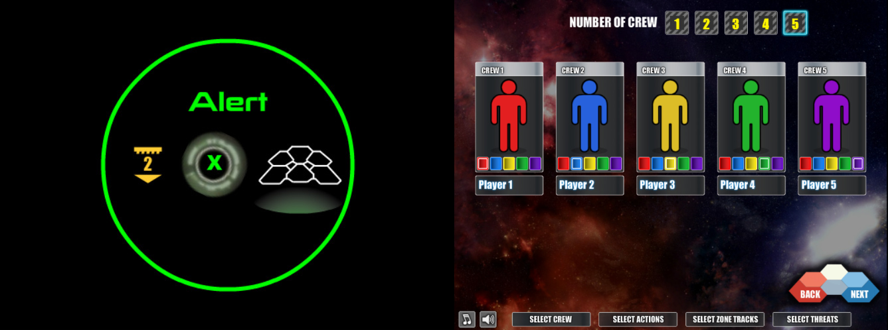

# spacealert

Bringing back two great [Space Alert](https://boardgamegeek.com/boardgame/38453/space-alert) tools: [Flash Player](https://boardgamegeek.com/thread/471529/space-alert-flash-player-version-13-now-randomizat) and [Flash Turn Resolution Processor](https://boardgamegeek.com/filepage/56253/space-alert-flash-turn-resolution-processor)

## Why
1. I just want to play Space Alert and have fun with my friends in current year (2023).
2. All tools links are dead and you have no easy way to use them.

## How to use
1. [Download this project as .zip](https://github.com/bcattaneo/spacealert/archive/refs/heads/main.zip)
2. Extract it
3. Execute either `mission.bat` (Flash Player) or `resolver.bat` (Flash Turn Resolution Processor)

## TODO
- Port both tools to a web app?

## Disclaimers
- [Space Alert](https://czechgames.com/en/space-alert) is a really fun board game made and copyrighted by [Czech Games Edition](https://czechgames.com). Go buy it!
- Adobe please don't take this down
- Both tools belong to their respective owners. If you're not comfortable with this project, just let me know and I'll delete it
